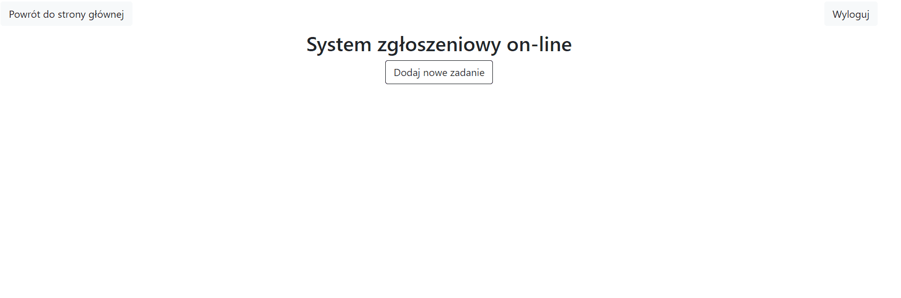
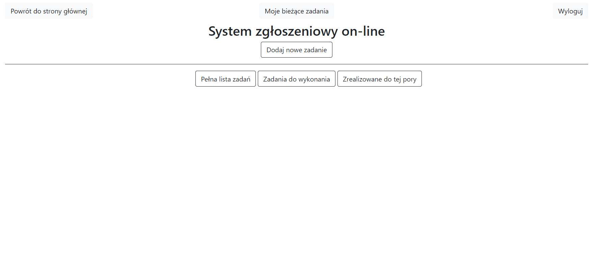
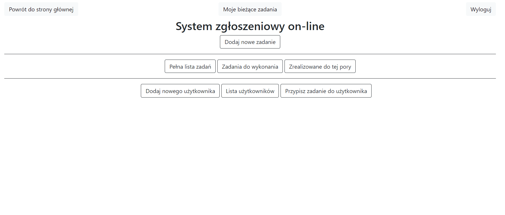

Task manager demo

Aplikacja pozwala zarządzać zadaniami przy użyciu przeglądarki internetowej. Docelowo stanie się ona pełnoprawnym systemem zgłoszeń awarii, błędów lub innnych zadań do wykonania. 

Funkcje, które aplikacja posiada:
- Dodawanie zadań do listy;
- Dodawanie, edycja i usuwanie użytkownikow;
- Przypisywanie zadań użytkownikom / podejmowanie zadań przez użytkownika;
- Oznaczanie zadań jako wykonane, edytowanie zadań oraz usuwanie ich z listy;
- Możliwość wyświetlenia szczegółów oraz edytowania zadań i użytkowników;
- Dostęp do poszczególnych funkcji ograniczony poprzez uprawnienia

<b>Dostęp użytkownika:</b>

<b>Wsparcie:</b>

<b>Administrator:</b>

