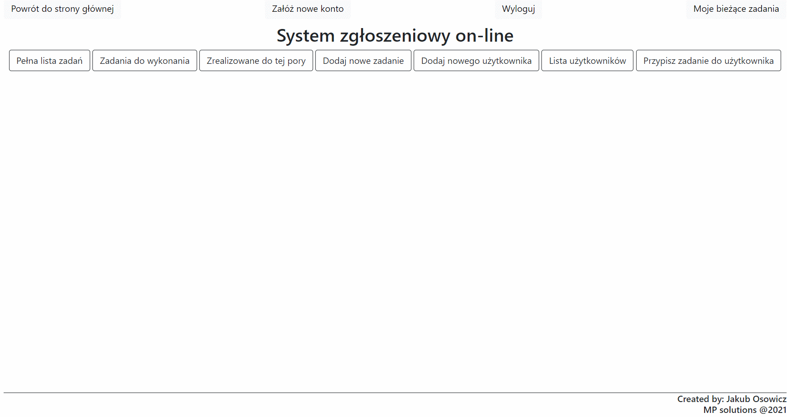

Task manager demo
(w trakcie tworzenia)

Aplikacja pozwala zarządzać zadaniami przy użyciu przeglądarki internetowej. Docelowo stanie się ona pełnoprawnym systemem zgłoszeń awarii, błędów lub innnych zadań do wykonania. 

Funkcje, które aplikacja posiada w tej chwili:
- Dodawanie zadań do listy;
- Dodawanie i usuwanie użytkownikow;
- Przypisywanie zadań użytkownikom / podejmowanie zadań przez użytkownika;
- Oznaczanie zadań jako wykonane, usuwanie ich z listy;
- Możliwość wyświetlenia szczegółów oraz edytowania zadań i użytkowników;
- Funkcje zależne od uprawneiń
- Współpraca z testową bazą danych h2

